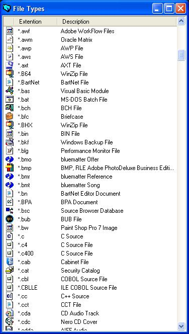



## \_Get File Info\_

### Description

Gets a list with all the File Types reciognised by your pc (from the registry).
 
### More Info
 

             |
---                |---
**Submitted On**   |2003-09-19 17:59:24
**By**             |[BelgiumBoy\_007](https://github.com/Planet-Source-Code/PSCIndex/blob/master/ByAuthor/belgiumboy-007.md)
**Level**          |Advanced
**User Rating**    |5.0 (25 globes from 5 users)
**Compatibility**  |VB 6\.0
**Category**       |[Registry](https://github.com/Planet-Source-Code/PSCIndex/blob/master/ByCategory/registry__1-36.md)
**World**          |[Visual Basic](https://github.com/Planet-Source-Code/PSCIndex/blob/master/ByWorld/visual-basic.md)
**Archive File**   |[\_Get\_File\_1649239232003\.zip](https://github.com/Planet-Source-Code/belgiumboy-007-get-file-info__1-48724/archive/master.zip)

